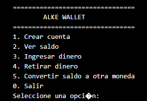

<div align="center">
<h1>Grupo Bastión </h1>

<div align="center">
<p>INTEGRANTES:</p>

|       Integrante        |    Rol        |
| :---------------------- | :------------ |
| 👤 **Felipe Martínez**  | Desarrollador |
| 👤 **Manuel Damke**     | Desarrollador |
| 👤 **Eugenio Zúñiga**   | Desarrollador |
</div>
    
</div>


<div align="center">
<h2>Proyecto de Módulo N°2</h2>

    
</div>
<p><h3>Evaluación del módulo: Proyecto Alke Wallet</h3> 

Situación inicial: 

📍 Unidad solicitante: Equipo de desarrollo de una empresa fintech

📌 El equipo de desarrollo ha recibido la solicitud de crear una wallet
digital para la empresa Alkemy Digital. La problemática a resolver es
brindar a los usuarios una solución segura y fácil de usar para
administrar sus activos financieros de manera digital. La wallet permitirá
a los usuarios realizar transacciones dentro de la plataforma. Nuestro
líder técnico ya cuenta con los requerimientos desagregados en un
backlog de tareas listo para que comencemos la etapa de desarrollo.

📋 Nuestro objetivo

El objetivo de nuestro proyecto "Alke Wallet" es desarrollar una billetera
digital que permita a los usuarios gestionar sus activos financieros de
manera segura y conveniente.
Nuestro objetivo es entregar una aplicación funcional, segura y fácil de
usar que proporcione a los usuarios una solución confiable para
administrar sus activos financieros de manera digital.

Requerimientos

La aplicación "Alke Wallet" deberá cumplir con una serie de requisitos y
especificaciones técnicas para garantizar su funcionalidad y calidad. A
continuación, se detallan los requerimientos generales y técnicos:

Requerimientos generales:

● Administración de fondos: El programa debe permitir crear una
cuenta, ver su saldo disponible, realizar ingreso y retiro de dinero
(debe impactar sobre el saldo actual).

● Conversión de moneda: El programa debe permitir convertir el
saldo de un tipo de moneda a otra.

Requerimientos técnicos/específicos:

● Backend: Java implementando el paradigma orientado a objetos
para desarrollar y gestionar la lógica del negocio. Utilizar interfaces
para reutilización de código.

● Diagramas de clase: Representar en un Diagrama de Clases el
modelo de clases que da solución a los requerimientos.

● Pruebas unitarias: Se realizarán pruebas unitarias para garantizar la
calidad y el correcto funcionamiento de los componentes
desarrollados.</p>


# 💳 AlkeWallet


Aplicación de billetera digital desarrollada en **Java**, que permite crear cuentas, administrar saldo (depósitos y retiros) y realizar **conversión de moneda**, manteniendo precisión financiera mediante el uso de `BigDecimal`.  
Incluye **menú interactivo por consola** y **pruebas unitarias con JUnit**.

---

## 📌 Funcionalidades

- Crear cuenta indicando titular y moneda base
- Ver saldo disponible
- Ingresar dinero
- Retirar dinero con validación de fondos
- Convertir saldo entre monedas (USD, CLP, EUR…)
- Uso de clase `BigDecimal` para mejor precicion en calculos.
- Arquitectura orientada a objetos
- Menú interactivo con `Scanner`

---

## 🛠 Tecnologías utilizadas

| Herramienta | Uso |
|------------ |------|
| Java  21    | Desarrollo de la aplicación |
| Maven       | Gestión de dependencias y build |
| JUnit 5     | Pruebas unitarias |
| JavaDoc     | Documentación del código

---

## 📂 Estructura del proyecto

```text
alkewallet/
├── src/
│ ├── main/java/cl/alkewallet/
│ │ ├── App.java # Menú principal en consola
│ │ ├── Cuenta.java # Clase modelo
│ │ ├── Convertidor.java # Interface conversión
│ │ ├── ConvertidorImplementacion.java
│ │ ├── TipoMoneda.java # Enum de monedas
│ │ └── ...
│ └── test/java/cl/alkewallet/
│ ├── CuentaTest.java # Test creación de cuenta
│ └── ConvertidorTest.java # Test conversión de moneda
| 
├── target/  #Documentación
└── pom.xml
```

---

## 🚀 Instalación y Ejecución

### Prerrequisitos

*   Tener instalado el **Java Development Kit (JDK)** (versión 21).

### Pasos

1.  **Clonar el repositorio** (o descargar los archivos):
    ```bash
    git clone https://github.com/escaheche/AlkeWallet.git
    ```

2.  **Navegar al directorio del proyecto**:
    ```bash
    cd AlkeWallet
    ```

3.  **Compilar el proyecto**:
    ```bash
    mvn clean package
    ```
4.  **Ejecutar test**:
    ```bash
    mvn test
    ```

5.  **Ejecutar la aplicación**:
    ```bash
    mvn exec:java -Dexec.mainClass="cl.alkewallet.App"0
    ```

6.  **Menú de la aplicación**:
    
    
    

## 💵 Tasas de Conversión (Referenciales)

El sistema utiliza las siguientes tasas de conversión fijas para la demostración:

*   1 USD = 770 CLP
*   1 EUR = 900 CLP

*   *Desarrollado para el bootcamp DESARROLLO DE APLICACIONES MÓVILES ANDROID TRAINEE V2.0*
